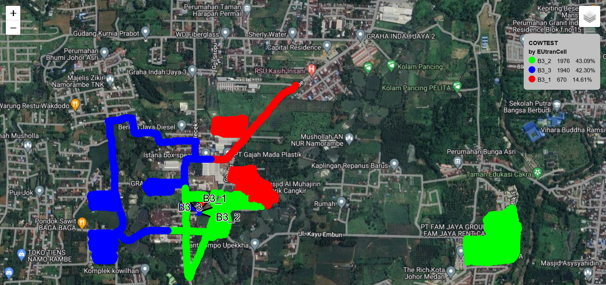
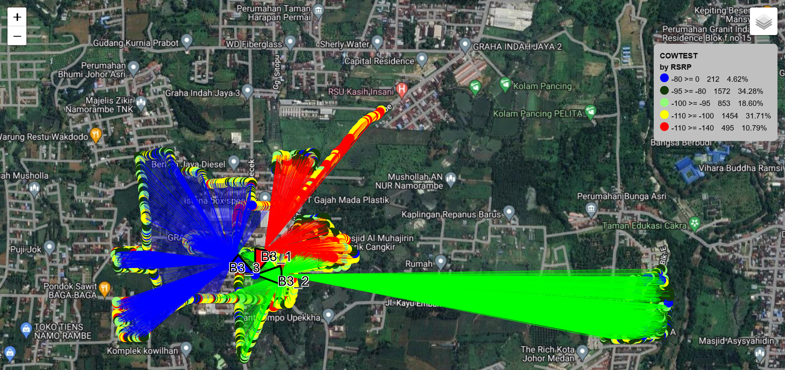

# GeoCellApp

## Output sample PCI or Cellname with spidergraph

## Output sample RSRP with spidergraph

## Overview

This tutorial will guide you through creating a geospatial visualization app called `GeoApp`. The app is designed to visualize geospatial data, including cellular coverage and signal strength, using Python libraries such as Folium, Pandas, and Streamlit.

## Libraries

1. **colorsys**
   The `colorsys` module provides functions to convert colors between different color systems, such as RGB and HSV. In this app, it's used to generate color codes in the HSV space, which are then converted to hexadecimal format for consistent color mapping.

2. **math**
   The `math` module is used for mathematical functions like trigonometry, which are essential for calculating angles, coordinates, and distances when creating sector beams and other map features.

3. **folium**
   `folium` is a powerful Python library used for creating interactive maps. It allows easy integration of different map tiles, markers, and layers. In this app, Folium is used to render maps, add markers for cell sites, and draw polygons representing sector beams.

4. **pandas**
   `pandas` is a data manipulation library that provides data structures and functions needed to work with structured data, particularly tabular data. In `GeoApp`, it is used to load and process geospatial data from CSV files or DataFrames.

5. **streamlit**
   `streamlit` is a framework for creating web apps directly from Python scripts. It simplifies the process of adding interactivity and UI elements to data-driven applications. In this project, Streamlit is used to build the front-end interface, allowing users to interact with the map and select various visualization options.

6. **branca.element**
   `branca` is a Python library that works with Folium to create complex map elements like legends, popups, and more. The `MacroElement` and `Template` classes from `branca.element` are used in this app to create dynamic legends that change based on the data being visualized.

## Map Tile Options

The `GeoApp` includes a method called `define_tile_options` that defines the different map tile options available for use in the application. Map tiles are the images or layers that make up the visual representation of the map background. The app provides two tile options:

### 1. **OpenStreetMap**
   - **URL:** `https://tile.openstreetmap.org/{z}/{x}/{y}.png`
   OpenStreetMap (OSM) is a free, editable map of the world, created and maintained by a community of mappers. It's known for its high quality and up-to-date geographical data. The OSM tile option provides a standard street map view, which is suitable for a wide range of geospatial visualization tasks. It's open-source and doesn't require any API keys or usage restrictions.

### 2. **Google Hybrid**
   - **URL:** `https://mt1.google.com/vt/lyrs=y&x={x}&y={y}&z={z}`
   The Google Hybrid tile combines both satellite imagery and road data, giving a comprehensive view that includes both natural features and man-made infrastructure. This tile is useful for visualizations where both geographical context and infrastructure details are important. The Google Hybrid tile provides a rich and detailed map view, but it typically requires API access and may have usage limits depending on the terms of service.

## Class Structure and Functionality

### 1. **Initialization**
   - Sets up data structures and initial calculations.
   - Prepares color assignments and map settings.

### 2. **Map Creation**
   - Initializes a Folium map with customizable tile options.
   - Allows user to select different map providers.

### 3. **Data Visualization**
   - Adds geocell sites with sector beams and labels.
   - Visualizes driveless data points.
   - Implements a spider graph connecting driveless points to cell edges.

### 4. **Color Coding**
   - Assigns unique colors to cell IDs.
   - Uses color gradients for RSRP values.

### 5. **Interactivity**
   - Provides popups with detailed information on markers.
   - Allows toggling between different visualization modes.

### 6. **Legend**
   - Adds a comprehensive legend explaining color codes for both cell IDs and RSRP values.

### 7. **Streamlit Integration**
   - Uses Streamlit for the user interface and app layout.
   - Implements category selection buttons for different visualization modes.

### 8. **Flexibility**
   - Adapts to different antenna sizes and configurations.
   - Calculates sector beams and edge points dynamically.

This class provides a comprehensive tool for visualizing and analyzing cellular network data, combining geographical information with network performance metrics in an interactive web application.
